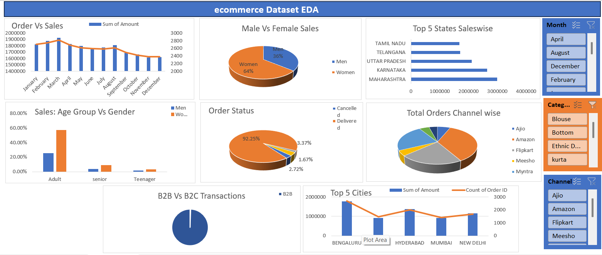

# 🛒 E-commerce Dataset – Exploratory Data Analysis (EDA)

## 📌 Project Overview
This project performs **Exploratory Data Analysis (EDA)** on an e-commerce dataset using **Microsoft Excel**.  
The goal is to clean raw data, analyze sales performance, customer behavior, and operational metrics, and present insights through dashboards and pivot-based analysis.

---

## 🧰 Tools & Technologies Used
- Microsoft Excel  
- Excel Formulas  
- Pivot Tables & Pivot Charts  
- Data Cleaning Techniques  

---

## 📊 Analysis Performed
- Monthly **Orders vs Sales** trend analysis  
- **Gender-wise** sales distribution  
- **Age group vs gender** purchasing behavior  
- **Top 5 states and cities** by sales  
- **Order status analysis** (Delivered, Cancelled, Returned)  
- **Channel-wise orders** (Amazon, Flipkart, Ajio, Meesho, Myntra)  
- **B2B vs B2C** transaction comparison  

---

## 📈 Dashboard Preview

---

## 📂 Project Structure
ecommerce-dataset-eda/
│
├── data/
│ └── eCommerce_raw_dataset.xlsx
│
├── cleaned_data/
│ └── Cleaned_dataset.xlsx
│
├── images/
│ └── ecommerce_eda_dashboard.png
│
└── README.md

---

## 🔍 Key Insights
- Majority of sales come from **female customers**
- **Adults** contribute the highest share of purchases
- **Maharashtra, Karnataka, and Uttar Pradesh** are top-performing states
- **Amazon and Flipkart** dominate order volume
- Over **90% orders are successfully delivered**
- Business is largely **B2C-focused**

---

## 🎯 Learning Outcomes
- Hands-on experience in **real-world data cleaning**
- Strong understanding of **pivot tables and dashboards**
- Ability to derive **business insights from raw data**
- Improved data presentation for stakeholders

---

## 👤 Author
**Shreya Chanore**  
- GitHub: https://github.com/shreyachanore  
- LinkedIn: www.linkedin.com/in/shreyachanore

---

